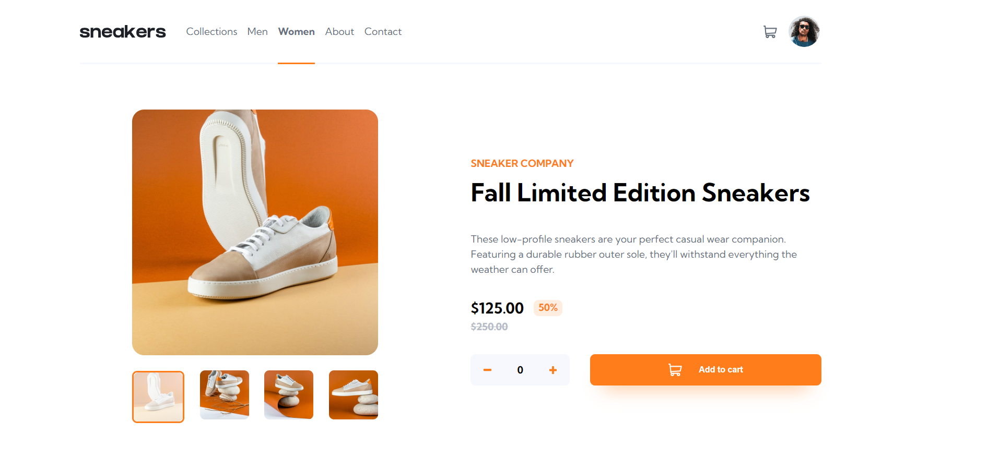

# Frontend Mentor - E-commerce product page solution

This is a solution to the [E-commerce product page challenge on Frontend Mentor](https://www.frontendmentor.io/challenges/ecommerce-product-page-UPsZ9MJp6). Frontend Mentor challenges help you improve your coding skills by building realistic projects.

## Table of contents

- [Frontend Mentor - E-commerce product page solution](#frontend-mentor---e-commerce-product-page-solution)
  - [Table of contents](#table-of-contents)
  - [Overview](#overview)
    - [The challenge](#the-challenge)
    - [Screenshot](#screenshot)
    - [Links](#links)
  - [My process](#my-process)
    - [Built with](#built-with)
    - [What I learned](#what-i-learned)
  - [Author](#author)

## Overview

### The challenge

Users should be able to:

- View the optimal layout for the site depending on their device's screen size
- See hover states for all interactive elements on the page
- Open a lightbox gallery by clicking on the large product image
- Switch the large product image by clicking on the small thumbnail images
- Add items to the cart
- View the cart and remove items from it

### Screenshot

### Links

- Solution URL: [https://github.com/Catevika/FrontendMentor_Product-page_by-Catevika](https://github.com/Catevika/FrontendMentor_Product-page_by-Catevika)
- Live Site URL: [https://frontendmentor-product-page-catevika.netlify.app/](https://frontendmentor-product-page-catevika.netlify.app/)

## My process

### Built with

- Semantic HTML5 markup
- CSS custom properties
- Flexbox
- Desktop-first workflow
- [Vite](https://vitejs.dev/) - Vite + React plugin
- [React-routeur-dom V6](https://reactrouter.com/en/main) - Client side routing for React
- [React-responsive](https://www.npmjs.com/package/react-responsive) package

### What I learned

- React-router-dom

- React Context: state management

- Session storage for persistent states during session only: see cart

- synchronization of the product quantities in the cart and in the product page

## Author

- English porfolio - [Catevika Portfolio EN](catevika.github.io/Catevika_Portfolio-EN/)
- French Portfolio - [Catevika Portfolio FR](catevika.github.io/Catevika_Portfolio-FR/)
- Frontend Mentor - [@Catevika](https://www.frontendmentor.io/profile/Catevika)
- Twitter - [@dominique_bello](https://twitter.com/dominique_bello)
